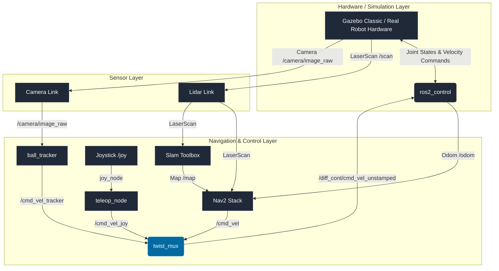
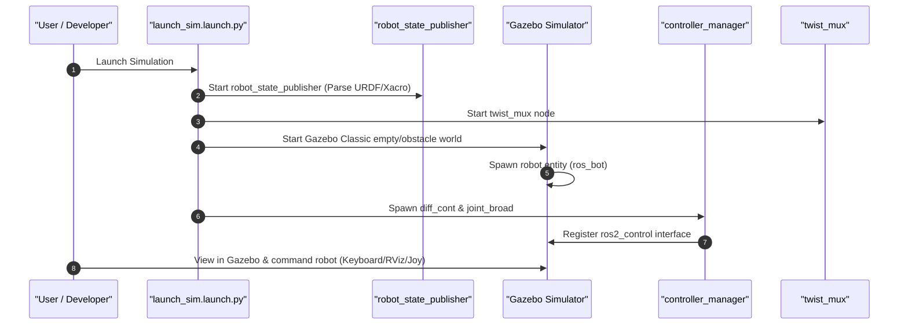
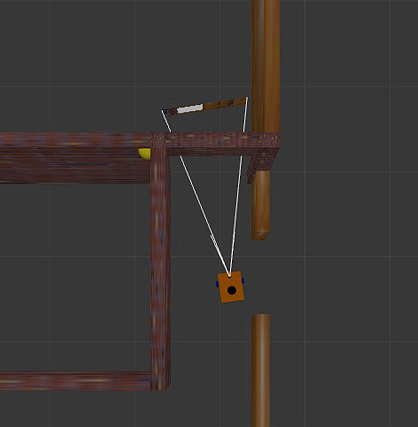
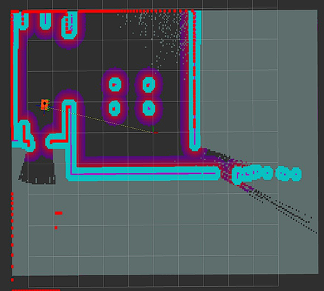
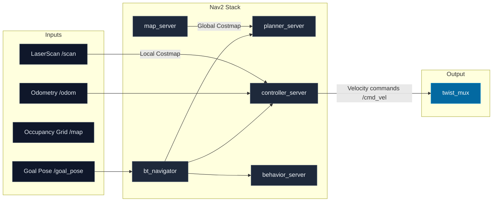
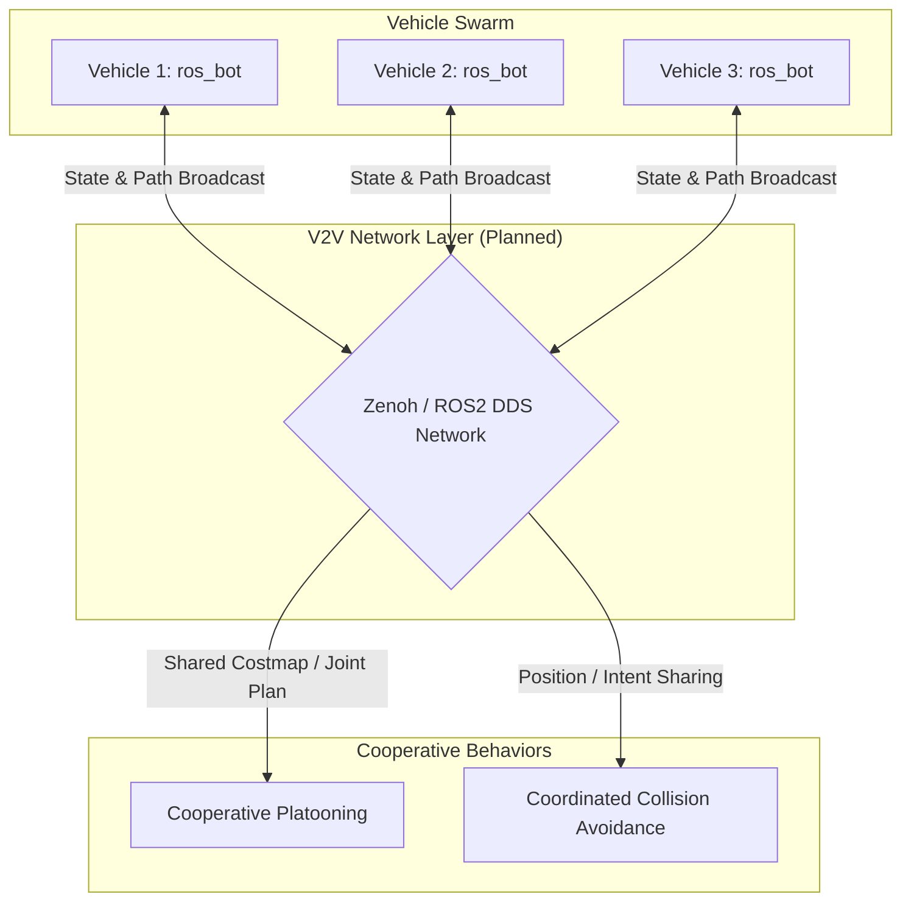
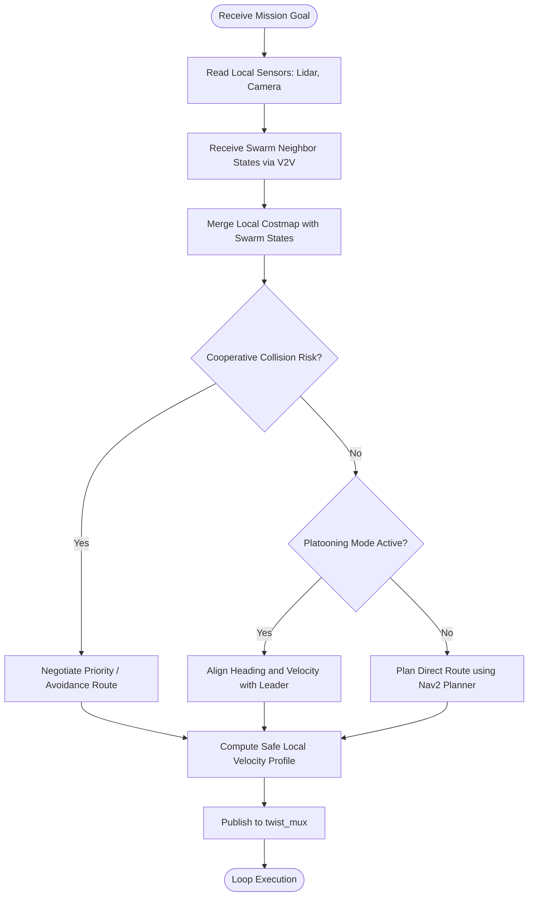
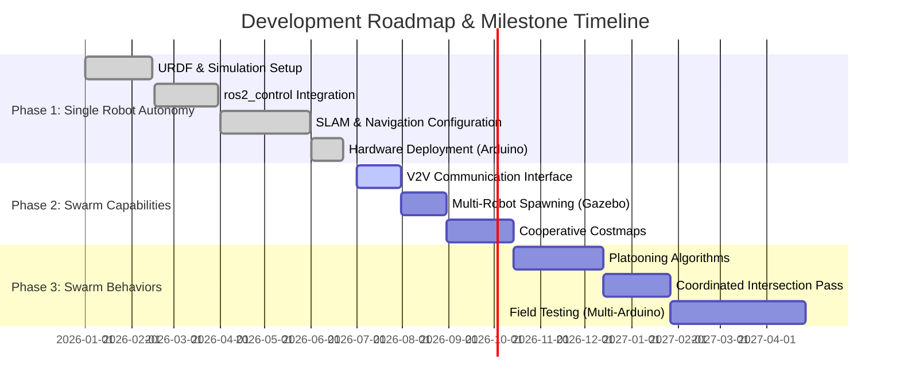

# Autonomous Vehicles with V2V Communication for Cooperative Driving

## 1. Project Overview
This repository hosts the **Autonomous Vehicles with V2V Communication for Cooperative Driving** research project. The core platform is a modular differential-drive robot (`ros_bot`) developed for ROS2 (Robot Operating System 2). The project aims to establish robust single-robot autonomy—incorporating high-fidelity physical/simulation modeling, active motor control, sensor integration (LiDAR, Camera), SLAM, and advanced path planning—before scaling to a decentralized swarm vehicle-to-vehicle (V2V) network for coordinated behavior (such as platooning, overtake synchronization, and intersection management).

---

## 2. Problem Statement
Modern autonomous driving systems face massive safety, throughput, and efficiency limits when operating in isolation. Autonomous vehicles (AVs) that rely solely on local sensors suffer from occlusions, limited sensing horizons, and sudden braking hazards. Without inter-vehicle cooperation:
* **Congestion increases** due to lack of platooning synchronization.
* **Collision risk peaks** at blind intersections and high-speed highway slip roads.
* **Reaction latency is bounded** by the mechanical limits of sensor processing instead of digital speed.

By bridging individual autonomy with Vehicle-to-Vehicle (V2V) communication, vehicles can share trajectories, state variables, and sensor maps to behave collectively as an intelligent swarm, minimizing collision rates and maximizing road utilization.

---

## 3. Objectives
* **Phase 1: Robust Individual Autonomy (Current Baseline)**: Build a fully functional simulated and physical 2-wheel differential-drive robot (`ros_bot`) capable of joystick control, autonomous mapping (SLAM), static/dynamic obstacle avoidance, and goal-directed navigation in Gazebo and real hardware.
* **Phase 2: Swarm Coordination (In Progress)**: Extend Gazebo simulations to spawn multiple robots simultaneously in the same environment and establish communication bridges between namespaces.
* **Phase 3: V2V Communication Protocol (Planned)**: Design and implement a low-latency state broadcast system (using ROS2 DDS or Zenoh) to share positions, velocity vectors, and local costmaps.
* **Phase 4: Cooperative Control Algorithms (Planned)**: Implement swarm behaviors such as synchronous platooning, coordinated overtaking, and collision-free intersection negotiation.

---

## 4. Project Evolution
The project began as an educational setup based on the Articulated Robotics robot description schema, leveraging standard controllers to establish basic mobility. To meet the requirements of cooperative autonomous driving research, the platform has evolved significantly:
1. **Physical Redesign**: Integrated dedicated LiDAR (`laser_frame`) and Camera mounts, customized chassis dimensions, and simulated a physical front face (`face.xacro`) to indicate robot heading visually.
2. **Modular Controller Stack**: Upgraded control architecture from basic open-loop velocity commands to ROS2 Control framework (`diff_drive_controller`), establishing seamless code reuse between the simulated robot (Gazebo) and the physical Arduino hardware.
3. **Advanced Velocity Multiplexing**: Implemented `twist_mux` to coordinate priority between manual override (joystick), autonomous local avoidance (ball tracking), and global navigation targets (Nav2).

---

## 5. Current Implementation
The repository currently implements a full single-robot autonomous stack:

### A. Robot URDF/Xacro Description
* **Kinematics**: Differential-drive model with two active drive wheels ($R = 3.3\text{ cm}$) and a single low-friction caster wheel for stability.
* **Sensors**:
  * **LiDAR**: RPLiDAR composition node (physical) and Gazebo ray sensor (simulated) publishing 360-degree range scans to the `/scan` topic.
  * **Camera**: Monocular camera (using `v4l2_camera` on hardware and `gazebo_ros_camera` in sim) for computer vision tasks.
* **Visuals**: Features a front-facing decorative plate (`face_link`) with cylinder eyes and nose to visually indicate vehicle orientation.

### B. Control Architecture (ros2_control)
* **Real Robot Hardware**: Serial-based motor driver (`diffdrive_arduino/DiffDriveArduino` plugin) communicating with an Arduino over USB `/dev/ttyUSB0` at 57600 baud, tracking a 3436 PPR encoder count.
* **Simulated Robot**: Gazebo hardware interface (`gazebo_ros2_control/GazeboSystem`) driven by joint velocity commands.
* **Controllers**: Implemented standard `DiffDriveController` (publishing `/odom` and tracking commands) and a `JointStateBroadcaster`.

### C. Mapping (SLAM)
* Integrates `slam_toolbox` via an online asynchronous mapping node (`async_slam_toolbox_node`). It builds occupancy grid maps dynamically and exposes serialization services to save posegraphs (`first_serial.posegraph`).

### D. Navigation Stack (Nav2)
* Highly customized Nav2 stack utilizing:
  * **Planner Server**: Generates smooth global trajectories over the static/dynamic costmaps.
  * **Controller Server**: Computes local velocity commands to follow paths.
  * **Behavior Server & BT Navigator**: Handles recovery behaviors (spins, backups) and executes navigation behavior trees.

### E. Sensor-Based Tracking (Ball Tracker)
* Integrates a visual tracking loop that consumes camera streams, runs color thresholds to detect a colored ball, and outputs high-priority velocity vectors to center and approach the object.

---

## 6. Future Implementation (Swarm & V2V)
The next phase of development focuses on multi-agent cooperative driving:

### A. Decentralized V2V Communications
* A dedicated V2V node will run on each robot, broadcasting telemetry data (pose, speed, goal) to a shared network using **Zenoh** or native **ROS2 DDS** partitions.
* Vehicles will subscribe to neighbors' telemetries, mapping them as dynamic bounding boxes in their local planning costmaps to prevent collision.

### B. Cooperative Driving Behaviors
* **Platooning (Leader-Follower)**: Followers lock onto the preceding vehicle's trajectory using distance-keeping control loops, drastically reducing inter-vehicle distance.
* **Intersection Coordination**: A distributed consensus algorithm will assign vehicle priority at unsignaled intersections, avoiding the need for traffic lights.

---

## 7. Technology Stack
* **Operating System**: Ubuntu 22.04 LTS / Windows (Dev Environment)
* **Framework**: ROS2 (Humble Hawksbill / Foxy Fitzroy)
* **Simulator**: Gazebo Classic (11.x)
* **Visualization**: RViz2
* **Navigation Stack**: Nav2 (Navigation2)
* **Mapping Engine**: Slam Toolbox
* **Control**: ros2_control, teleop_twist_joy, twist_mux
* **Hardware Interface**: Arduino IDE, C++ Serial Communication, RPLidar SDK

---

## 8. Repository Structure
```
├── .gitignore
├── README.md                           <- Main project documentation (This file)
├── first_save.pgm                      <- SLAM-generated occupancy grid map image
├── first_save.yaml                     <- SLAM map metadata
├── first_serial.data                   <- Slam Toolbox posegraph serialization data
├── first_serial.posegraph              <- Slam Toolbox posegraph serialization file
├── docs/                               <- Project documentation resources
│   └── images/
│       ├── project_banner.png          <- High-quality project banner
│       ├── project_logo.png            <- High-quality project logo
│       ├── gazebo_simulation.png       <- Gazebo Classic ball-tracking simulation output
│       ├── rviz_navigation.png         <- RViz2 mapping & navigation costmap output
│       ├── ros2_bot_navigation_demo.mp4 <- Local video of robot navigation simulation
│       └── carla_swarm_intelligence_demo.mp4 <- Local video of CARLA swarm simulation
└── src/
    └── ros_bot/                        <- Main ROS2 Package
        ├── CMakeLists.txt              <- Package build configuration
        ├── package.xml                 <- Package manifest and dependencies
        ├── README.md                   <- Package-level pointer
        ├── config/                     <- Parameter files for navigation, mapping, and control
        │   ├── ball_tracker_params_robot.yaml
        │   ├── ball_tracker_params_sim.yaml
        │   ├── drive_bot.rviz
        │   ├── empty.yaml
        │   ├── gaz_ros2_ctl_use_sim.yaml
        │   ├── gazebo_params.yaml
        │   ├── joystick.yaml
        │   ├── main.rviz
        │   ├── map.rviz
        │   ├── mapper_params_online_async.yaml
        │   ├── my_controllers.yaml
        │   ├── nav2_params.yaml
        │   ├── twist_mux.yaml
        │   └── view_bot.rviz
        ├── description/                <- URDF Xacro robot model components
        │   ├── camera.xacro
        │   ├── depth_camera.xacro
        │   ├── face.xacro
        │   ├── gazebo_control.xacro
        │   ├── inertial_macros.xacro
        │   ├── lidar.xacro
        │   ├── robot.urdf.xacro
        │   ├── robot_core.xacro
        │   └── ros2_control.xacro
        ├── launch/                     <- Python launch files for sim, robot, sensors
        │   ├── ball_tracker.launch.py
        │   ├── camera.launch.py
        │   ├── joystick.launch.py
        │   ├── launch_robot.launch.py
        │   ├── launch_sim.launch.py
        │   ├── localization_launch.py
        │   ├── navigation_launch.py
        │   ├── online_async_launch.py
        │   ├── rplidar.launch.py
        │   └── rsp.launch.py
        └── worlds/                     <- Gazebo classic world definition files
            ├── empty.world
            ├── new.world
            └── obstacles.world
```

---

## 9. System Architecture
The following Mermaid diagram outlines the system connectivity and topic flows inside the ROS2 computational graph:



---

## 10. Installation

### 1. Prerequisites
Ensure you have a supported ROS2 distribution installed (Ubuntu 22.04 + ROS2 Humble Desktop is highly recommended).

Install the required ROS2 package dependencies:
```bash
sudo apt update
sudo apt install -y \
  ros-${ROS_DISTRO}-navigation2 \
  ros-${ROS_DISTRO}-nav2-bringup \
  ros-${ROS_DISTRO}-slam-toolbox \
  ros-${ROS_DISTRO}-ros2-control \
  ros-${ROS_DISTRO}-ros2-controllers \
  ros-${ROS_DISTRO}-gazebo-ros2-control \
  ros-${ROS_DISTRO}-twist-mux \
  ros-${ROS_DISTRO}-joy \
  ros-${ROS_DISTRO}-teleop-twist-joy \
  ros-${ROS_DISTRO}-v4l2-camera
```

### 2. Workspace Setup
Clone this repository to your local computer or development board (e.g. Raspberry Pi):
```bash
# Create a ROS2 workspace directory
mkdir -p ~/av_ws/src
cd ~/av_ws/src

# Clone the repository
git clone https://github.com/your-username/Autonomous-Vehicles-with-V2V-Communication-for-Cooperative-Driving.git .

# Install python dependencies for ball tracker if using it
# (Make sure to clone the ball_tracker repository if needed)
```

### 3. Compilation
Build the workspace using `colcon`:
```bash
cd ~/av_ws
colcon build --symlink-install
source install/setup.bash
```

---

## 11. Build & Run Instructions

### A. Gazebo Simulation Mode
To start the robot, controllers, joystick teleoperation, and spawn it inside a Gazebo simulator with obstacles:
```bash
ros2 launch ros_bot launch_sim.launch.py world:=src/ros_bot/worlds/obstacles.world
```

### B. Mapping & Map Saving
Run SLAM Toolbox online asynchronous mapping:
```bash
ros2 launch ros_bot online_async_launch.py use_sim_time:=true
```
* Use RViz2 to visualize the generated occupancy map:
  ```bash
  rviz2 -d src/ros_bot/config/map.rviz
  ```
* Save the map using the map saver utility:
  ```bash
  ros2 run nav2_map_server map_saver_cli -f ~/my_map
  ```

### C. Autonomous Navigation (Nav2)
Ensure you have a saved map. Then run the localization and navigation stacks:
1. **Localization**:
   ```bash
   ros2 launch ros_bot localization_launch.py map:=/path/to/my_map.yaml use_sim_time:=true
   ```
2. **Navigation Planner/Controller**:
   ```bash
   ros2 launch ros_bot navigation_launch.py use_sim_time:=true
   ```
3. Open RViz to set 2D Goal Poses:
   ```bash
   rviz2 -d src/ros_bot/config/main.rviz
   ```

### D. Physical Hardware Deployment
To launch the control loop on the physical robot (communicating with the Arduino controller and RPLidar sensor):
```bash
ros2 launch ros_bot launch_robot.launch.py
```
And launch the LiDAR node in a separate terminal:
```bash
ros2 launch ros_bot rplidar.launch.py
```

---

## 12. Simulation Workflow
This sequence diagram shows the step-by-step startup process for a simulation run:



---

## 13. Visual Outputs & Demonstration Videos

### Gazebo Simulation Output
The figure below illustrates the differential-drive robot (`ros_bot`) navigating through the obstacle world in Gazebo Classic with camera field-of-view projections and active ball tracking.
<p align="center">
  
</p>

### RViz Mapping & Navigation Output
The figure below represents the active SLAM mapping and localized navigation view in RViz, detailing occupancy grids, laser scan points, dynamic costmap inflation rings, and target path generation.
<p align="center">
  
</p>

### Project Demonstration Videos
We have captured simulation and hardware outputs demonstrating autonomous path planning, navigation, and V2V swarm cooperative driving:

#### 1. ROS2 Differential Drive Navigation Demo
This video demonstrates the differential-drive robot (`ros_bot`) executing autonomous path planning, localization, and obstacle avoidance maneuvers.
<p align="center">
  <video src="docs/images/ros2_bot_navigation_demo.mp4" controls width="80%"></video>
</p>

#### 2. CARLA Swarm Intelligence Simulation Demo
This video shows cooperative driving and platoon coordination behaviors implemented inside the high-fidelity CARLA simulator.
<p align="center">
  <video src="docs/images/carla_swarm_intelligence_demo.mp4" controls width="80%"></video>
</p>

#### 3. Cloud Demonstration Links
* **Google Drive Video**: [Cooperative Driving Swarm Intelligence Demo](https://drive.google.com/file/d/13LTX3jLqMJH9VEQh4ONzBhIodVnespoM/view?pli=1)

---

## 14. Navigation Pipeline
This flowchart illustrates the navigation stack's loop, from sensory input to actuator commands passing through `twist_mux`:



---

## 15. Current Project Status

| Feature / Component | Category | Status | Details |
| :--- | :--- | :--- | :--- |
| **URDF Robot Model** | Autonomy Baseline | **Completed** | Full links, joints, inertials, and visual features. |
| **Gazebo Simulator Support** | Autonomy Baseline | **Completed** | Visualizes joints, lidar, camera, and obstacle worlds. |
| **ros2_control Hardware Loop** | Control System | **Completed** | Supports Arduino serial bridge and Gazebo system plugin. |
| **SLAM (Mapping)** | Navigation | **Completed** | Implemented using async Slam Toolbox. |
| **Nav2 Stack** | Navigation | **Completed** | Planners, recovery nodes, and behavior tree navigation. |
| **Command Multiplexing** | Control System | **Completed** | `twist_mux` prioritized command blending. |
| **Camera Object Tracking** | Computer Vision | **Completed** | Color thresholding ball tracker. |
| **Multi-Robot Spawning** | Swarm Capabilities | **In Progress** | Spawning multiple namespace-isolated URDF models. |
| **V2V Broker Layer** | Communication | **Planned** | Zenoh / DDS data pipeline development. |
| **Cooperative Driving** | Swarm Capabilities | **Planned** | Platooning and collision consensus algorithms. |

---

## 16. Future Roadmap

### Swarm & V2V Pipeline Concept
Below is the planned decentralized swarm communication architecture:



### Cooperative Driving Swarm Logic
The flowchart below traces how future V2V variables will merge into the local navigation decisions:



### Timeline Roadmap



---

## 17. Team Members & Maintainers

### Project Developers (Team Members)
* **Sanjay M**
* **Sivasakthi R**
* **Sanjeevikumar M**
* **Sindhujashree R**
* **Ragavarshini A**

### Project Mentor
* **Mathi Yuvarajan T K**

### Platform Maintainers & Original Contributors
* **Josh Newans** - Platform Maintainer (Original Robot URDF & Hardware Guides)

---

## 18. References
* **Articulated Robotics**: Guide on building a mobile robot from scratch (ROS2 + Gazebo + diffdrive_arduino).
* **ROS2 Navigation2 Documentation**: [https://navigation.ros.org/](https://navigation.ros.org/)
* **Slam Toolbox ROS2**: [https://github.com/SteveMacenski/slam_toolbox](https://github.com/SteveMacenski/slam_toolbox)
* **Zenoh Network Protocol**: [https://zenoh.io/](https://zenoh.io/) for V2V edge communications.


